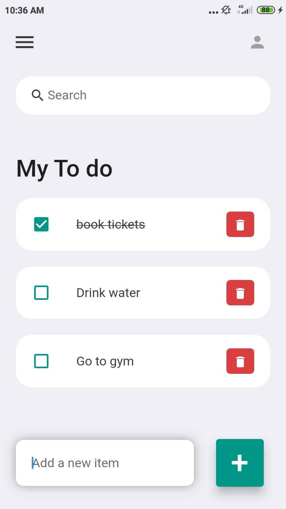

```markdown
# Flutter Todo App

A basic to-do app built with Flutter. This app provides essential functionality to manage your tasks, including adding, deleting, updating, and searching for existing to-do items.

## Features

- Add new to-do items to your list.
- Delete completed or unwanted tasks.
- Update the status or details of a task.
- Search for specific tasks within your list.

## Screenshots




## Getting Started

Follow these instructions to set up and run the project on your local machine.

### Prerequisites

- Flutter SDK (https://flutter.dev/docs/get-started/install)
- Git

### Installation

1. Clone the repository:

   ```sh
   git clone https://github.com/your-username/flutter-todo-app.git
   ```

2. Navigate to the project directory:

   ```sh
   cd flutter-todo-app
   ```

3. Install dependencies:

   ```sh
   flutter pub get
   ```

### Usage

1. Run the app:

   ```sh
   flutter run
   ```

2. Add tasks by entering the task details and tapping the 'Add' button.

3. To delete a task, swipe left on the task item and confirm the deletion.

4. To update a task, tap on the task item and make the necessary changes.

5. Use the search bar at the top to search for specific tasks.

## Contributing

Contributions are welcome! If you have any enhancements or bug fixes, please follow these steps:

1. Fork the repository.

2. Create a new branch: `git checkout -b feature/my-feature`.

3. Make your changes and commit them: `git commit -m 'Add some feature'`.

4. Push the branch: `git push origin feature/my-feature`.

5. Create a pull request detailing your changes.

## License

This project is licensed under the [MIT License](LICENSE).
